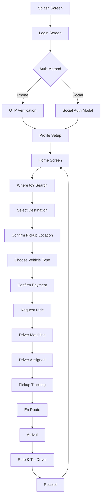

# DashDrive App Journey

Complete user flow from onboarding to ride completion.

---

## 1. Onboarding & Authentication

### 1.1 Splash Screen
- App logo animation
- Auto-redirect to login after 2.5 seconds

### 1.2 Login Screen
**Options:**
- Phone number entry (country code + number)
- Social auth buttons: Apple, Google, Facebook

**UI Elements:**
- Country flag + code selector
- Phone number input field
- "OR" divider
- Social auth buttons (rounded, full-width)
- Terms & Conditions footer

### 1.3 Social Auth Modal
- Animated bottom sheet slides up
- Provider branding (logo + name)
- User profile preview (avatar, name, email)
- "Continue as [Name]" primary button
- Privacy policy & terms links

### 1.4 Profile Setup
- First name + Last name input
- Email verification prompt (if not via social)
- Profile photo upload (optional)

---

## 2. Home Screen

### 2.1 Map View
- Full-screen Google Maps
- Current location indicator (blue pulsing dot)
- Nearby driver markers
- Side menu button (hamburger icon)

### 2.2 Bottom Sheet
- "Where to?" search prompt
- Recent destinations list
- Quick access: Home, Work, Saved Places
- Schedule ride option (calendar icon)

### 2.3 Side Menu
- User profile card (photo, name, membership status)
- Menu options:
  - History
  - Payment
  - Saved Places
  - Promos
  - Support
  - Settings
- Theme toggle (Light/Dark/System)
- Log Out button

---

## 3. Booking a Ride

### 3.1 Destination Search
- "Your route" header
- Pickup location (auto-filled from GPS)
- Destination search field with keyboard
- Recent destinations list
- Airport/station quick suggestions
- Map picker option

### 3.2 Multi-Stop Support
- Add stops with "+" button
- Reorder stops via drag handles
- Remove stops with "×" button

### 3.3 Location Confirmation
- Map view with pin marker
- "Select where the car should stop"
- Draggable pin for precise location
- "Confirm location" primary button
- Estimated fare preview

### 3.4 Saved Places
- Custom names (Home, Work, custom labels)
- Icon selection for visual categorization
- Quick access from home screen

---

## 4. Ride Selection

### 4.1 Vehicle Options
**Categories:**
- Standard (economy)
- Comfort (premium)
- XL (larger vehicles)
- VIP/Premium (luxury)

**Card displays:**
- Vehicle illustration
- Ride type name
- Price estimate
- ETA to pickup
- Available features (e.g., pet-friendly, baby seat)

### 4.2 Price Breakdown
- Base fare
- Per-km rate
- Per-minute rate
- Booking fee
- Surge pricing indicator (if applicable)
- Promo code input

### 4.3 Payment Method
- Default payment shown
- Options: Card, Cash, Wallet, Apple Pay
- Add new payment method

### 4.4 Confirm Booking
- "Request Ride" primary button
- Driver assignment begins

---

## 5. Ride in Progress

### 5.1 Driver Matching
- "Finding your driver" loading state
- Driver profiles with ratings
- Cancel option with timer

### 5.2 Driver Assigned
- Driver card:
  - Photo
  - Name
  - Rating (stars)
  - Vehicle details (make, model, color, plate)
- ETA to pickup
- "Share trip" option
- Contact driver (call/message)

### 5.3 Pickup Tracking
- Real-time driver location on map
- Route line from driver to pickup
- "Driver is arriving" notification
- Verification code (for safety)

### 5.4 En Route
- "Heading to [Destination]" header
- Estimated arrival time
- Live route tracking
- Share trip status with contacts
- Promo cards (optional marketing)

### 5.5 Safety Features
- Emergency button
- Share live location
- Trip details visible to trusted contacts

---

## 6. Ride Completion

### 6.1 Arrival
- "You've arrived" notification
- Final fare display
- Payment automatically processed

### 6.2 Rating & Review
- 5-star rating for driver
- Optional feedback categories:
  - Navigation
  - Cleanliness
  - Conversation
  - Driving
- Tip option (preset amounts or custom)
- Submit button

### 6.3 Receipt
- Trip summary:
  - Date/time
  - Pickup → Destination
  - Distance
  - Duration
  - Fare breakdown
- Email receipt option
- Report issue link

---

## 7. Wallet & Payments

### 7.1 Wallet Balance
- Current balance display
- Transaction history
- Top-up options
- Auto-top-up settings

### 7.2 Payment Methods
- Saved cards list
- Add new card (camera scan or manual)
- Set default payment
- Remove payment method

### 7.3 Promos
- Active promo codes
- Apply new code
- Promo terms & conditions

---

## 8. Settings & Account

### 8.1 Profile
- Edit personal info
- Update phone number
- Change profile photo
- Email preferences

### 8.2 Privacy & Security
- Two-factor authentication
- Trusted devices
- Data download request
- Delete account

### 8.3 Preferences
- Language selection
- Theme mode (Light/Dark/System)
- Notification settings
- Communication preferences

### 8.4 Support
- Help center
- Report an issue
- Contact support
- FAQs

---

## Flow Diagram

---

## Key Screens Summary

| Phase | Screens |
|-------|---------|
| Onboarding | Splash, Login, Social Auth Modal, Profile Setup |
| Home | Map View, Side Menu, Bottom Sheet |
| Booking | Search, Location Pin, Vehicle Selection, Payment |
| Ride | Driver Card, Tracking Map, Share Trip |
| Completion | Rating, Tip, Receipt |
| Account | Wallet, Settings, Support |
