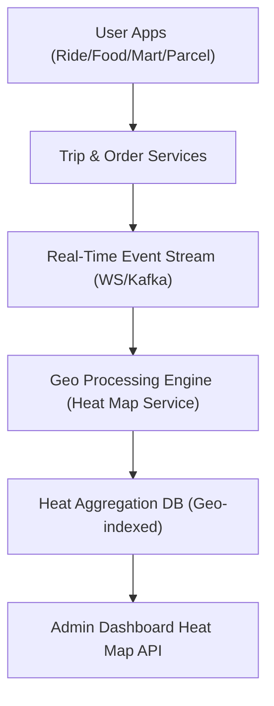

# Heat Map Backend Architecture & API Schema

This document outlines the production-grade backend architecture, database schema, and API structures for the GoGrab Heat Map system.

## 🔷 Core Data Flow


## 🗄️ Database Schema

### 1. `zones` (Geo Zone Management)
Used for heat segmentation and surge pricing.
- `id` (UUID)
- `name` (varchar)
- `coordinates` (polygon / geojson)
- `center_point` (point)
- `is_active` (boolean)

### 2. `live_locations` (Real-Time GPS Tracking)
Tracks drivers, couriers, and agents.
- `id`, `user_id`, `user_type`
- `service_type` (ride, food, mart, etc.)
- `latitude`, `longitude`
- `status` (online, busy, offline)

### 3. `service_requests` (Demand Source Table)
Unified requests across all services.
- `id`, `service_type`, `zone_id`
- `latitude`, `longitude`
- `status` (pending, completed, etc.)

### 4. `orders_trips` (Unified Transaction Layer)
Economic activity records for Revenue maps.
- `id`, `service_type`, `total_amount`, `commission_amount`

### 5. `heatmap_aggregates` (Precomputed Heat Data)
**Critical for performance.** Fast map rendering via time buckets.
- `time_bucket` (5min, hourly, daily)
- `demand_count`, `supply_count`
- `imbalance_score`, `revenue_total`

## 🧮 Core Logic

### Imbalance Score
```
Imbalance Score = Demand / (Supply + 1)
```
- **> 2.0**: 🔴 Red (Shortage)
- **1.0 - 2.0**: 🟠 Orange (High Demand)
- **0.7 - 1.0**: 🟢 Green (Balanced)
- **< 0.7**: 🔵 Blue (Oversupply)

## 🔌 API Structure

### 1️⃣ `GET /api/admin/heatmap`
Main query for demand/supply distribution.

### 2️⃣ `GET /api/admin/heatmap/supply-demand`
Specific imbalance ratio per zone.

### 3️⃣ `POST /api/admin/heatmap/compare`
Body includes `service_a`, `service_b`, `date_range`, and `heat_mode` for side-by-side analysis.

## 🔄 Real-Time Delivery
- **WebSockets/Socket.io** for live updates.
- **Kafka** for high-throughput event streaming.
- **Redis** for caching pre-aggregated heat tiles (5-30s refresh).
